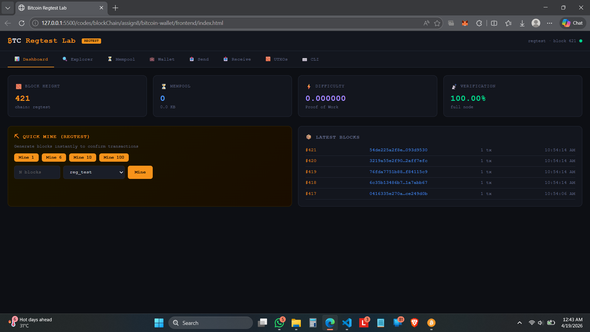
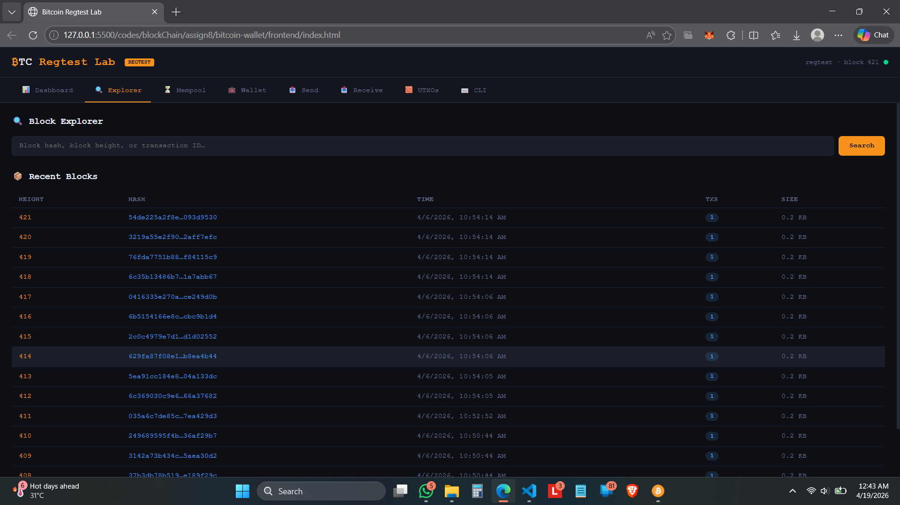
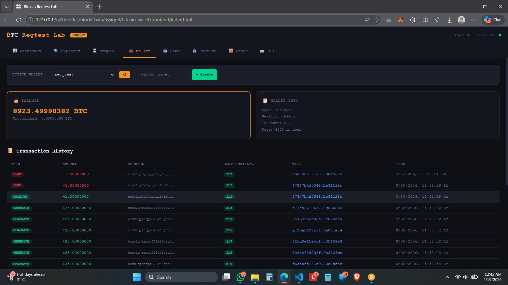
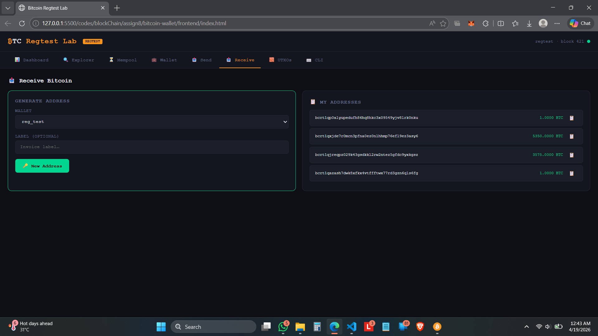
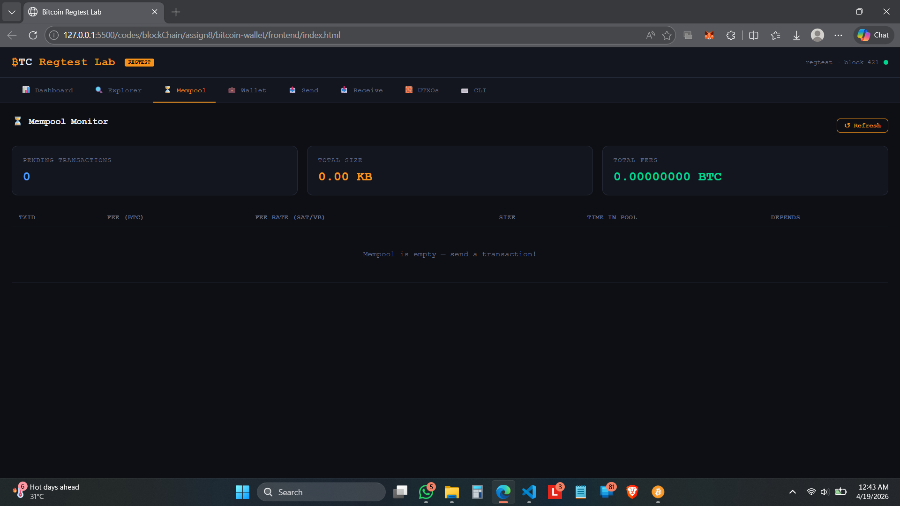

# ₿ Bitcoin Regtest Lab

A local Bitcoin development environment where you can explore blocks, manage wallets, send transactions, and even mine blocks — all in one place.

---

## 🚀 What this is

This project is a **full-stack Bitcoin regtest sandbox** built to understand how Bitcoin works under the hood.

It includes:

* a simple **block explorer**
* a **wallet interface**
* **mempool + transaction tracking**
* and a **CLI-style interaction layer**

---

## ⚙️ Features

* 📊 View blockchain info (blocks, difficulty, mempool)
* 🔍 Explore blocks and transactions
* 💼 Create and manage wallets
* 📤 Send & receive Bitcoin (regtest)
* ⛏️ Mine blocks instantly
* 🧱 View UTXOs
* ⌨️ Run Bitcoin RPC commands from UI

---

## 🛠️ Tech

* **Frontend:** HTML, CSS, JavaScript
* **Backend:** Node.js + Express
* **Blockchain:** Bitcoin Core (Regtest)
* **RPC:** JSON-RPC

---

## 📸 Screenshots

### Dashboard



### Explorer



### Wallet



### Send Transaction



### Mempool



---

## 🧪 Running Locally

### 🔧 Prerequisites

* Node.js (v16+)
* Bitcoin Core installed

---

## 1️⃣ Install Bitcoin Core

Download from the official site:
👉 https://bitcoincore.org/en/download/

Install it on your system.

---

## 2️⃣ Create Bitcoin Config File

Create a file named `bitcoin.conf` inside any data directory (e.g., `D:\ProgramFiles\Bitcoin\data`)
Make sure the file is saved with a `.conf` extension.

Add the following:

```conf
# Global settings
server=1
txindex=1

[regtest]
rpcuser=bitcoin
rpcpassword=bitcoin123
rpcport=18443
rpcallowip=127.0.0.1
```
(Optional) If transactions fail due to fee estimation, add:
```conf
fallbackfee=0.0001
---

## 3️⃣ Start Bitcoin in Regtest Mode

Update the paths according to your installation and run:

```bash
D:\file-path\bitcoin-qt.exe --regtest -datadir=D:\file-path\data
```

This will start a local Bitcoin node in **regtest mode**.

---

## 4️⃣ Start Backend Server

```bash
cd backend
npm install
npm start
```

You should see:

```
Bitcoin Lab Backend running on http://localhost:3001
```

---

## 5️⃣ Open the Frontend

Open this file in your browser:

```text
frontend/index.html
```

---

## 6️⃣ First-Time Setup (Important)

* Create a wallet from the UI
* Mine at least **101 blocks** to get usable balance
* Now you can:

  * send transactions
  * explore blocks
  * view mempool

---

## ⚠️ Notes

* Works only on **Bitcoin Regtest**
* Make sure backend and Bitcoin node are running at the same time
* RPC credentials must match `bitcoin.conf`

---

## 👤 Author

Atif Azeem

---

## 💭 thoughts

* built this to understand how bitcoin actually works instead of just reading theory  
* still improving it as i learn more

---
